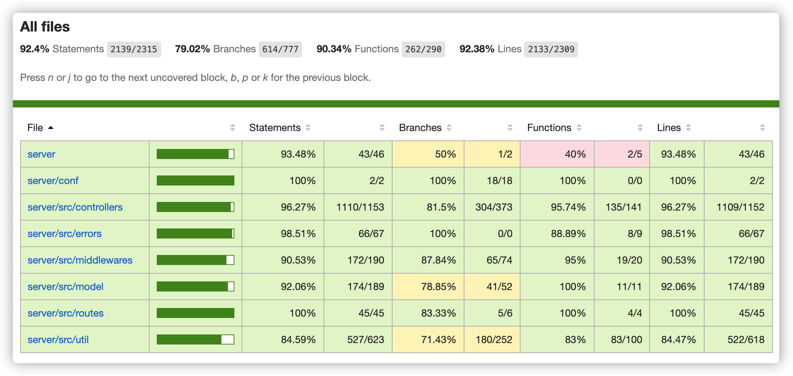

### Execute unit tests

The unit test is currently only for the server API interface part. Execute the following command to perform the unit test:

```
cd wolf/server
npm run test
```

After execution, if all tests are successful, the output will look like this:

```
➜  server git:(master) ✗ npm run test

> wolf-server@0.1.0 test
> ./node_modules/.bin/nyc --reporter=html mocha test/*.test.js --exit --timeout 10000

  framework
    router
user [root] is exist!
      ✔ ping (38ms)
      ✔ not found 001 (286ms)
user [admin] is exist!
      ✔ not found 002 (44ms)
      ✔ request internal method start with _ (68ms)
    token check
      ✔ token missing
      ✔ token invalid
      ✔ token ok (51ms)

    ......

      ✔ userInfo success by refreshTokenInfo1.access_token (59ms)
      ✔ access check success by refreshTokenInfo1.access_token (100ms)
      ✔ userInfo failed, token expired (2019ms)
      ✔ token by password success (102ms)
      ✔ access check failed, token missing
      ✔ access check success (52ms)
      ✔ token by password failed, User not found (41ms)
      ✔ token by password failed, Password is incorrect (179ms)
      ✔ token by client_credentials success
      ✔ userInfo success by clientCredentialsTokenInfo.access_token
    rbac-destroy
      ✔ application (58ms)
      ✔ category (54ms)
      ✔ permission (40ms)
      ✔ role
      ✔ user (530ms)
      ✔ resource


  317 passing (36s)
```

After all the unit tests are executed, a coverage report will be generated in `server/coverage`. The current code statement coverage is around `92%`.


|  |
|:--:|
| *Coverage - Overview* |


|  |
|:--:|
| *Coverage - Detail* |

